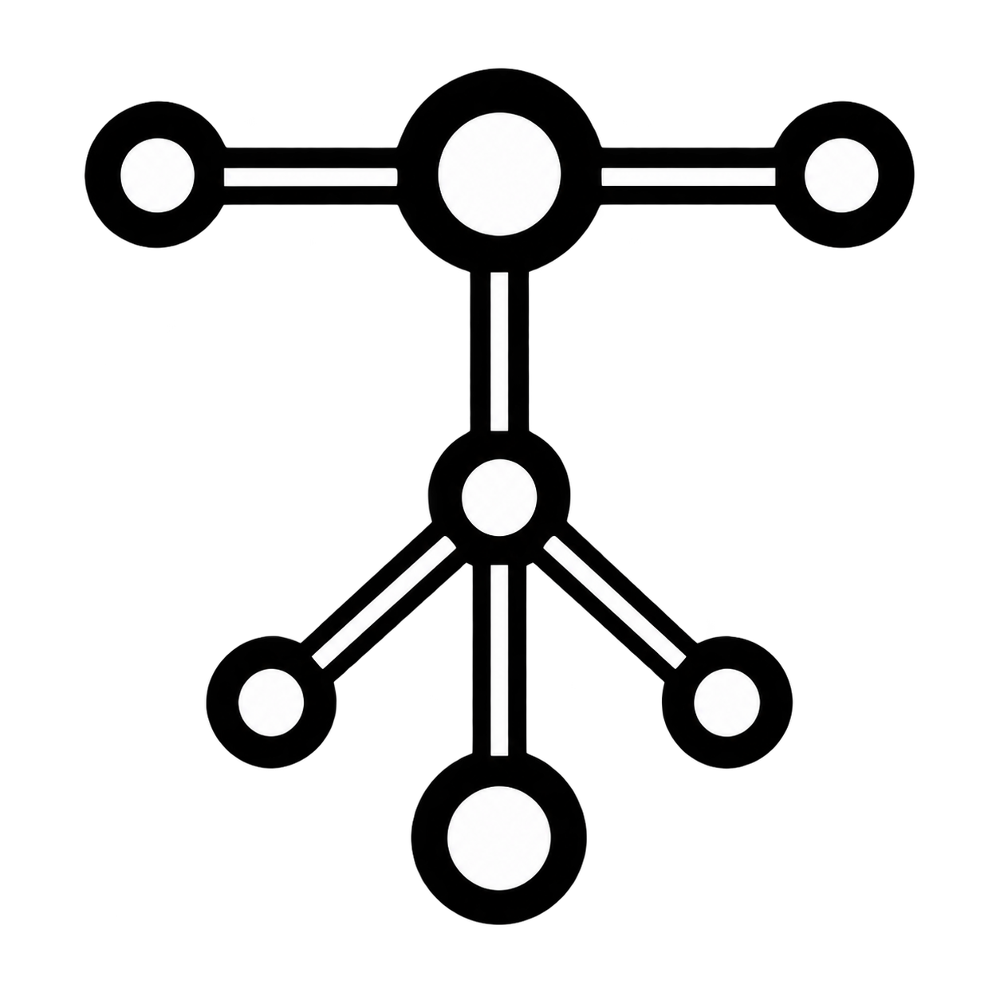

<p align="center">
  
</p>

<h1 align="center">toolgraph</h1>

<p align="center">
  A visual canvas for wiring MCP tools together — statically type-checked
  against the tools' real JSON Schemas, then exported as code you own.
</p>

<p align="center">
  <a href="#license"></a>
  
  
</p>

---

## What toolgraph is

Wiring [Model Context Protocol](https://modelcontextprotocol.io) tools together
is the "n8n for agents" problem, and it has a specific failure mode: tool A
returns `{ user: { id: number } }`, tool B wants `{ userId: string }`, and
nothing tells you until the run explodes in production.

toolgraph fixes that by making the type check a **design-time** operation.
Every connection you draw between two tools is checked against both tools'
real JSON Schemas — the ones the MCP server actually advertises — before the
edge is allowed to exist. An incompatible connection tells you the field, the
expected type, and the actual type, inline on the canvas.

When the graph is right, you **export it**: standalone TypeScript (real
interfaces generated from the schemas, plus `zod` validators) or Python
(Pydantic models plus typed functions). The exported code has **zero toolgraph
runtime dependency**. It is yours. You can delete your account and the code
keeps working.

### What you can do with it

1. Sign up, and connect an MCP server (stdio, SSE, or streamable HTTP).
2. See every tool that server exposes, as a node on the canvas.
3. Wire tool outputs into tool inputs. Compatible connections snap. Incompatible
   ones are rejected with the exact mismatch.
4. Run the graph live against the real servers and watch each step stream back.
5. Export the whole thing as TypeScript or Python and walk away with it.
6. Save, rename, duplicate and version your graphs.

---

## Architecture

```
                            ┌──────────────────────────────┐
                            │           Browser            │
                            │                              │
                            │   reactflow canvas           │
                            │   Monaco export preview      │
                            │   PostHog + Sentry (client)  │
                            └──────────────┬───────────────┘
                                           │ HTTPS
                     ┌─────────────────────┴─────────────────────┐
                     │                                           │
       ┌─────────────▼──────────────┐            ┌───────────────▼───────────────┐
       │   apps/web  (Vercel)       │            │  apps/engine  (Render, free)  │
       │   Next.js 15 App Router    │            │  Fastify, stateless           │
       │                            │            │                               │
       │   • auth (Supabase SSR)    │            │  POST /introspect             │
       │   • saved graphs CRUD      │            │       → tool JSON Schemas     │
       │   • POST /api/export       │            │  POST /run  (SSE stream)      │
       │     → packages/codegen     │            │       → per-step results      │
       │   • rate limit (Upstash)   │            │  GET  /health                 │
       │   • CSP w/ per-request     │            │                               │
       │     nonce, HSTS, no eval   │            │  ┌─────────────────────────┐  │
       └────────┬───────────────────┘            │  │  SSRF guard             │  │
                │                                │  │  hostname + resolved IP │  │
                │                                │  │  blocklist, re-checked  │  │
                │                                │  │  after DNS resolution   │  │
                │                                │  └───────────┬─────────────┘  │
                │                                └──────────────┼────────────────┘
                │                                               │
     ┌──────────▼──────────┐  ┌──────────────┐   ┌──────────────▼──────────────┐
     │      Supabase       │  │   Upstash    │   │   User's MCP servers        │
     │  Postgres + RLS     │  │  Redis REST  │   │   (stdio / SSE / HTTP)      │
     │  Auth + Vault       │  │  rate limits │   │   @modelcontextprotocol/sdk │
     └─────────────────────┘  └──────────────┘   └─────────────────────────────┘
                │
     ┌──────────▼──────────┐
     │       Resend        │
     │  welcome / confirm  │
     │  / magic-link mail  │
     └─────────────────────┘
```

**Shared packages** (no build step — consumed as TypeScript source):

| Package                  | What it does                                                                                  |
| ------------------------ | --------------------------------------------------------------------------------------------- |
| `@toolgraph/schema-core` | JSON Schema compatibility checking. Zero runtime dependencies. Used by both apps.             |
| `@toolgraph/codegen`     | TypeScript (`json-schema-to-typescript` + `zod`) and Python (Pydantic) generators. Node-only. |
| `@toolgraph/mcp-client`  | Wrapper around `@modelcontextprotocol/sdk` with the SSRF guard and hard timeouts.             |
| `@toolgraph/ui`          | Shared monochrome React primitives, and the canonical design tokens.                          |

### Why the engine is a separate service

The Next.js app runs on Vercel, where a serverless function cannot hold a long
stdio subprocess or a multi-minute streaming MCP session. The engine is a plain
long-running Fastify process instead.

It runs on Render's **free** tier, which sleeps after 15 minutes of inactivity
and drops open connections when it does. Two consequences shaped the design:

- **Stateless per request.** A test-run sends the whole graph plus any needed
  per-call credentials in one HTTP request. Nothing is kept between requests, so
  a sleep cycle loses nothing.
- **SSE, not WebSockets.** Intermediate steps stream back over Server-Sent
  Events on the _same_ request that started the run, rather than assuming a
  separate persistent socket survives.

The UI shows an explicit "waking up the execution engine" state for the cold
start, which takes roughly 30-50 seconds on the free plan.

---

## Repository layout

```
toolgraph/
├── apps/
│   ├── web/                  Next.js 15 app — canvas, auth, saved graphs, export UI
│   └── engine/               Fastify execution engine — deployed to Render
├── packages/
│   ├── schema-core/          JSON Schema compatibility checking
│   ├── codegen/              TypeScript + Python export generators
│   ├── mcp-client/           @modelcontextprotocol/sdk wrapper + SSRF guard
│   └── ui/                   Shared monochrome React primitives + design tokens
├── supabase/migrations/      SQL migrations, every table with explicit RLS
├── e2e/                      Playwright smoke tests
├── .github/workflows/        CI and deploy
├── render.yaml               Render Blueprint for apps/engine
└── .env.example              Every variable, with where to find it
```

---

## Local development

### Prerequisites

- **Node 22.x** (`.nvmrc` pins `22.22.2`; run `nvm use`)
- **pnpm 10.x** (`corepack enable` or `npm i -g pnpm`)
- **gitleaks** — required by the pre-commit hook, which fails closed without it
  (`brew install gitleaks`)
- **Docker** — only needed to run the Supabase local stack for the RLS tests
- **Supabase CLI** — only for migrations and the local stack
  (`brew install supabase/tap/supabase`)

### Setup

```bash
git clone https://github.com/br3h/toolgraph.git
cd toolgraph
nvm use                       # Node 22.22.2
pnpm install                  # also installs the git hooks

cp .env.example .env.local    # then fill it in — see below
pnpm dev                      # web on :3000, engine on :8787
```

`.env.example` documents every variable and exactly where in each service's
dashboard to find its value. Every service used has a free tier that is enough
to run toolgraph locally: Supabase, Upstash, Resend, Sentry and PostHog.

The **only** variables you need for the app to boot are the three Supabase ones.
Sentry and PostHog are no-ops when their variables are empty, and rate limiting
falls back to a permissive in-memory limiter when Upstash is not configured, so
a contributor can get productive without signing up for five services.

### Database

```bash
supabase start                       # local Postgres, Auth, Studio (needs Docker)
supabase db reset                    # applies everything in supabase/migrations/
pnpm test:rls                        # asserts user B cannot read user A's rows
```

To apply migrations to a hosted project:

```bash
supabase login
supabase link --project-ref <your-project-ref>
supabase db push
```

### Running things

| Command             | What it does                                           |
| ------------------- | ------------------------------------------------------ |
| `pnpm dev`          | Runs `apps/web` and `apps/engine` together             |
| `pnpm dev:web`      | Just the Next.js app, on `http://localhost:3000`       |
| `pnpm dev:engine`   | Just the Fastify engine, on `http://localhost:8787`    |
| `pnpm build`        | Production build of both apps                          |
| `pnpm lint`         | ESLint across the monorepo, zero warnings tolerated    |
| `pnpm typecheck`    | `tsc --noEmit` in every package and app                |
| `pnpm test`         | Vitest unit and integration tests                      |
| `pnpm test:rls`     | RLS isolation tests against the local Supabase stack   |
| `pnpm test:e2e`     | Playwright smoke test (signup → create graph → canvas) |
| `pnpm secrets:scan` | Runs gitleaks over the working tree                    |

### Connecting to an MCP server locally

The SSRF guard blocks loopback and private addresses by design. To point the
engine at an MCP server running on your own machine, set
`ENGINE_ALLOW_PRIVATE_NETWORK=true` in `.env.local`. **This must stay unset in
every deployed environment** — the engine refuses to start if it is enabled
while `NODE_ENV=production`.

---

## Security

The full policy, including how to report a vulnerability privately, is in
[SECURITY.md](SECURITY.md). There is **no bug bounty**.

Highlights of what is implemented, not just described:

- **SSRF guard** on every outbound MCP connection: hostname _and_ every
  DNS-resolved IP is checked against a blocklist covering loopback, RFC1918,
  link-local, CGNAT, unique-local IPv6 and cloud metadata endpoints. Re-checking
  after resolution is what makes DNS rebinding ineffective.
- **`zod` validation** on every API route and engine endpoint, with explicit
  body size limits.
- **Row Level Security** on every table, with a CI test proving cross-user reads
  fail.
- **CSP with a per-request nonce**, no `unsafe-eval`, and `connect-src` limited
  to Supabase, Sentry, PostHog and the engine origin.
- **No secret in any client bundle** — verified by grepping the production build
  output for the actual values in CI's final step.
- **Secrets never persisted in plaintext**: per-server credentials are either
  passed through at connect time or stored in Supabase Vault.
- **gitleaks pre-commit hook** that fails closed.

---

## Deployment

`apps/web` deploys to **Vercel** and `apps/engine` to **Render**.

### Which deploy path is used, and why

**Vercel's native GitHub integration is the production deploy path**, not the
`deploy.yml` workflow. The native integration is more reliable here for three
reasons: it produces preview deployments per PR for free, it does not require
storing a `VERCEL_TOKEN` in GitHub Actions secrets (one fewer long-lived
credential), and it cannot fall out of sync with Vercel's build environment.

`deploy.yml` therefore does **not** build or upload anything. It runs _after_
merge to `main` and **verifies** the deploy: it polls `/api/health` on the web
app and `/health` on the engine until both report the merged commit SHA, and
fails the run if they do not converge. Render's own GitHub integration handles
the engine deploy the same way.

If you would rather have GitHub Actions own the Vercel deploy, set
`VERCEL_TOKEN`, `VERCEL_ORG_ID` and `VERCEL_PROJECT_ID` as repository secrets
and flip `USE_GITHUB_VERCEL_DEPLOY` to `true` in `deploy.yml`.

### Render (engine)

`render.yaml` is a Render Blueprint. Creating a Blueprint the first time
requires one click in the dashboard — Render has no CLI-only path for it:

1. Render dashboard → **New** → **Blueprint**.
2. Point it at this repository. It reads `render.yaml`.
3. Set the environment variables it lists as `sync: false` (they are never
   committed). `render.yaml` names exactly which ones.

### Steps that need you

Four things cannot be done from a terminal, because each needs a browser
session or a dashboard click:

1. **Apply the migrations to the hosted Supabase project.** `supabase login`
   opens a browser for device authorisation, so it cannot run unattended:

   ```bash
   supabase login
   supabase link --project-ref <the subdomain of your NEXT_PUBLIC_SUPABASE_URL>
   supabase db push
   ```

   Until this runs, signup fails, because the tables do not exist yet. The
   migrations themselves are verified: CI applies them from scratch and runs
   the RLS isolation tests against them on every push.

2. **Create the Render Blueprint.** Render has no CLI path for the first
   creation. Dashboard → **New** → **Blueprint** → point it at this repo; it
   reads `render.yaml`. Then set the six variables that file marks
   `sync: false`, taking the values from your `.env.local`:
   `ENGINE_ALLOWED_ORIGINS`, `SENTRY_DSN_BACKEND`, `UPSTASH_REDIS_REST_URL`,
   `UPSTASH_REDIS_REST_TOKEN`, `SUPABASE_URL` and `SUPABASE_SECRET_KEY`.

3. **Enable the GitHub auth provider.** Supabase dashboard → Authentication →
   Providers → GitHub. It needs a GitHub OAuth app (Settings → Developer
   settings → OAuth Apps) whose callback URL is
   `https://<your-project-ref>.supabase.co/auth/v1/callback`. Email and
   password sign-in works without this; only the GitHub button depends on it.

   While you are there, add your deployment URL to Authentication → URL
   Configuration → Redirect URLs, or OAuth will refuse to redirect back.

4. **Add the DNS records below**, once you are ready to point `toolgraph.dev`
   at the deployment.

### Custom domain — DNS records to add in Namecheap

For **toolgraph.dev**, in Namecheap → Domain List → Manage → Advanced DNS.
Delete Namecheap's default "parking page" `CNAME @ parkingpage.namecheap.com`
and `URL Redirect` records first, or they will shadow these.

| Type    | Host     | Value                          | TTL       | What it is                          |
| ------- | -------- | ------------------------------ | --------- | ----------------------------------- |
| `ALIAS` | `@`      | `cname.vercel-dns.com.`        | Automatic | Apex → the Vercel app               |
| `CNAME` | `www`    | `cname.vercel-dns.com.`        | Automatic | `www` → the Vercel app              |
| `CNAME` | `engine` | `<your-service>.onrender.com.` | Automatic | `engine.toolgraph.dev` → the engine |

Namecheap supports `ALIAS` at the apex, which is what Vercel wants. If you
prefer Vercel's A-record path instead, use `A @ 76.76.21.21` — check the exact
value Vercel shows you in **Project → Settings → Domains**, since it can change.

For **Resend** email on this domain, Resend → Domains → Add `toolgraph.dev`
shows the exact records to copy. They take this shape:

| Type  | Host                | Value                                             | Notes                           |
| ----- | ------------------- | ------------------------------------------------- | ------------------------------- |
| `TXT` | `send`              | `v=spf1 include:amazonses.com ~all`               | SPF                             |
| `TXT` | `resend._domainkey` | `p=<long public key Resend gives you>`            | DKIM                            |
| `MX`  | `send`              | `feedback-smtp.us-east-1.amazonses.com` (prio 10) | Bounce handling                 |
| `TXT` | `_dmarc`            | `v=DMARC1; p=none;`                               | DMARC, optional but recommended |

Copy the DKIM value from the Resend dashboard verbatim — it is unique to your
domain and is not reproducible here.

After DNS resolves, set `NEXT_PUBLIC_SITE_URL=https://toolgraph.dev` and
`NEXT_PUBLIC_ENGINE_URL=https://engine.toolgraph.dev` in the Vercel dashboard,
and add `https://toolgraph.dev` to `ENGINE_ALLOWED_ORIGINS` in Render. Also add
`https://toolgraph.dev/auth/callback` to Supabase → Authentication → URL
Configuration → Redirect URLs.

### Current deployment

| Service         | URL                                                   | Status  |
| --------------- | ----------------------------------------------------- | ------- |
| Web (Vercel)    | https://toolgraph-af2yda6dx-br3hs-projects.vercel.app | live    |
| Engine (Render) | not created yet — see "Steps that need you" above     | pending |

The Vercel project is linked to this repository, so every push to `main`
deploys automatically. Its root directory is `apps/web`, and all fourteen
environment variables are set — `NEXT_PUBLIC_*` as config, because Next inlines
them at build time and a value stored as a secret would not be readable then,
and everything else as secrets.

### Health checks

| Endpoint                     | Returns                                    |
| ---------------------------- | ------------------------------------------ |
| `/api/health` on the web app | `200` with commit SHA, build time, version |
| `/health` on the engine      | `200` with commit SHA, build time, uptime  |

Both are unauthenticated, cheap, and safe to point a free uptime monitor at.
The web one already reports the deployed commit and which integrations it can
see.

---

## Design system

Strictly monochrome. Pure black, pure white, and a ten-step neutral ramp defined
once as CSS variables in `packages/ui/src/styles.css`. Light and dark derive
from that single ramp, inverted — there is no second palette. Emphasis comes
from weight and contrast, never hue. Error, success and warning states use an
icon, text and an outline.

There is exactly **one** documented exception: a canvas connection that fails
the type check is drawn with a **dashed stroke**. Greyscale alone cannot
distinguish a valid edge from a rejected one at canvas zoom levels, so stroke
pattern carries that one signal. It is still not a hue, and it applies nowhere
outside the canvas edge layer.

`prefers-color-scheme` is respected, with a manual toggle persisted to
`localStorage`.

---

## Contributing

See [CONTRIBUTING.md](CONTRIBUTING.md). Please also read the
[Code of Conduct](CODE_OF_CONDUCT.md).

## License

MIT — see [LICENSE](LICENSE).
